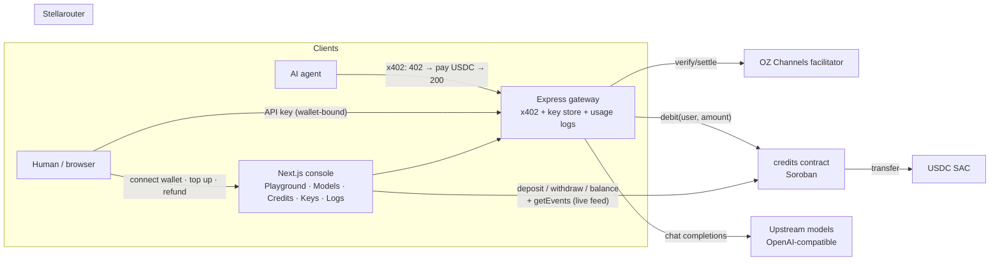
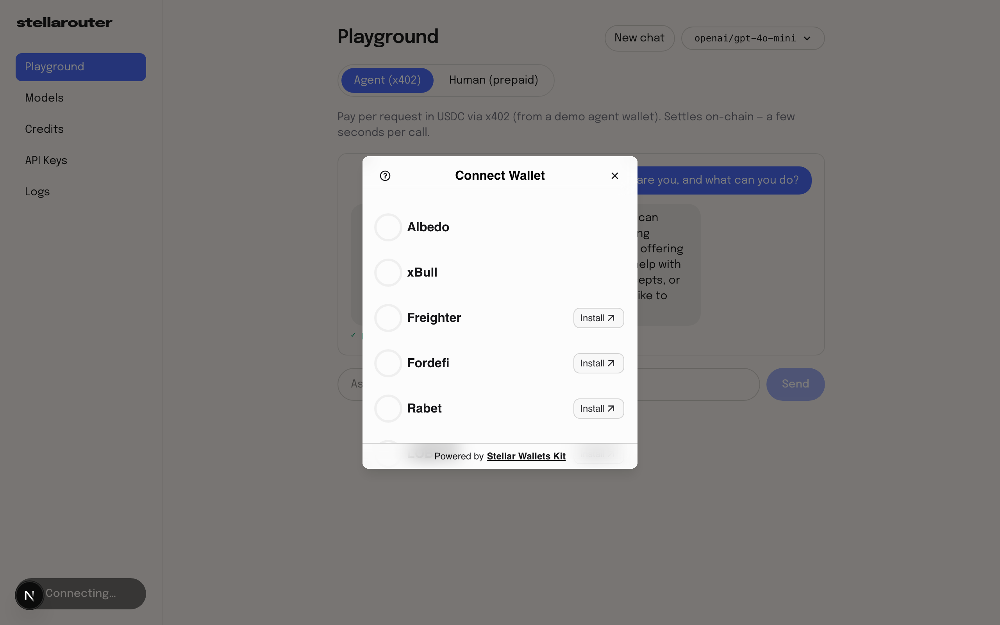
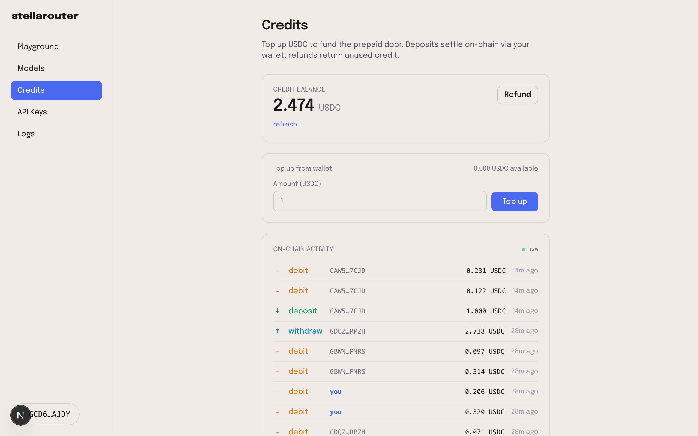
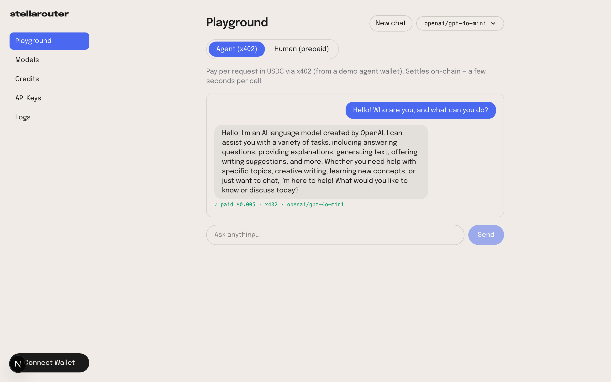

# Stellarouter

> **OpenRouter with verifiable billing** — an LLM gateway where AI agents pay
> per-call in USDC via **x402** (zero XLM needed), and humans top up a prepaid
> credit balance that lives **on-chain** in a Soroban contract: transparent,
> auditable, and refundable at any time.

Built on **Stellar testnet** for the [RiseIn Stellar Journey to Mastery](https://www.risein.com/programs/stellar-journey-to-mastery-monthly-builder-challenges) builder challenge.

## Why this exists

- **AI agents can't own credit cards.** LLM APIs hide behind subscriptions and
  human-owned API keys. Stellarouter's agent door speaks x402: request → `402
  Payment Required` → pay $0.005 USDC → response. No account, no key, no XLM
  (network fees are sponsored by the OpenZeppelin Channels facilitator).
- **Humans can't audit their LLM bills.** Stellarouter's human door is prepaid
  credit à la OpenRouter — but the balance lives in the [`credits` contract](smart-contract/contracts/credits/src/lib.rs),
  every `deposit`/`debit`/`withdraw` emits a public contract event, and unused
  credit is withdrawable. Your wallet is your account.

Ecosystem comparison and positioning: [docs/COMPARISON.md](docs/COMPARISON.md) · Roadmap: [docs/ROADMAP.md](docs/ROADMAP.md)

## On-chain artifacts (testnet)

| Artifact | Value |
|---|---|
| `credits` contract | [`CAEFFQAL6SGQF6OV5BOBE23NAC2T7WXOUUE5XRDOH2KRN2HXRMDXA7RE`](https://stellar.expert/explorer/testnet/contract/CAEFFQAL6SGQF6OV5BOBE23NAC2T7WXOUUE5XRDOH2KRN2HXRMDXA7RE) |
| Contract-call tx — `deposit(3 USDC)` | [`451bb3fb…5131c0a7`](https://stellar.expert/explorer/testnet/tx/451bb3fb3c6fdf4d9da72dc06b713052bd77dbf0b1d9668c591bc8435131c0a7) |
| Contract-call tx — `debit` (gateway charges usage) | [`3e39f867…b61fd37b`](https://stellar.expert/explorer/testnet/tx/3e39f867d128a54b8e9c748133ef9363f235a6d9a27fa9f27b2807d7b61fd37b) |
| Contract-call tx — `withdraw` (refund unused credit) | [`3a622a71…418b3275`](https://stellar.expert/explorer/testnet/tx/3a622a71b577ee925eb0bfe404d46f78492eb690bbc49cff8f075a78418b3275) |
| Admin / gateway operator | `GDYS2IMCFRSBIR2DDJV2E6TLEQI5A45SEBICIIXUDIAQIOC5IRUR7UTC` |
| USDC (Circle testnet) | issuer `GBBD47IF…FLA5` · SAC `CBIELTK6…DAMA` |

## Architecture



- **Two payment doors, one gateway.** Agents pay per call (x402); humans
  prepay into the contract and the gateway debits usage per request.
- **Real-time state sync.** The console polls RPC `getEvents` for the credits
  contract — deposits/debits/withdraws stream into a live activity feed and
  auto-refresh your balance when the gateway charges you.
- **Multi-wallet.** Connect with Freighter, xBull, Albedo, Lobstr, Hana, and
  more via [Stellar Wallets Kit](https://stellarwalletskit.dev/).

## Monorepo

| Path | What |
|---|---|
| [`smart-contract/`](smart-contract/) | Soroban workspace — `credits` prepaid USDC vault (9 unit tests) |
| [`backend/`](backend/) | Express gateway — x402 door, prepaid door, key store, usage logs, user simulation |
| [`frontend/`](frontend/) | Next.js console — Playground, Models, Credits, API Keys, Logs |
| [`landing-page/`](landing-page/) | Marketing site |
| [`packages/ui/`](packages/ui/) | Shared brand + wallet provider (`@stellarouter/ui`) |
| [`docs/`](docs/) | Roadmap, ecosystem comparison, screenshots |

## Quickstart (testnet)

Prereqs: [Bun](https://bun.sh), Node 20+, Rust + [Stellar CLI](https://developers.stellar.org/docs/tools/cli) (only for contract work).

```bash
# 1. Install workspace deps (frontend, landing, packages)
bun install

# 2. Backend gateway
cd backend
bun install
cp .env.example .env       # isi OZ_API_KEY (https://channels.openzeppelin.com/testnet/gen)
npm start                  # → http://localhost:3001

# 3. Frontend console (new terminal, repo root)
cd frontend && bun run dev # → http://localhost:3000
```

Try it:

- **Human door** — open the console, connect a wallet (testnet), go to
  **Credits**, top up 1 USDC, watch the tx status go pending → confirmed and
  your deposit appear in the live on-chain activity feed.
- **Agent door** — `cd backend && npm run client` (needs `PAYER_SECRET_KEY`
  with a USDC trustline + balance): it negotiates the 402, pays 0.005 USDC,
  and prints the completion.
- **Simulate users** — populate the contract with realistic traffic:

  ```bash
  cd backend
  node scripts/simulate-users.js --users 3 --debits 2 --fund 3 --withdraw
  ```

  Each simulated user is friendbot-funded, gets a USDC trustline (auto-bought
  on the testnet DEX when the treasury runs low), deposits into the contract,
  gets debited by the gateway, and one withdraws — all visible in the
  activity feed and on the explorer.

## Smart contract

`credits` — prepaid USDC vault (SEP-41 SAC token, 7 decimals):

| Function | Auth | Purpose |
|---|---|---|
| `deposit(from, amount)` | user | USDC in → API credit 1:1 (emits `deposit`) |
| `debit(user, amount)` | admin | gateway charges usage → treasury (emits `debit`) |
| `withdraw(user, amount)` | user | refund unused credit (emits `withdraw`) |
| `collect(to, amount)` | admin | sweep treasury revenue (emits `collect`) |
| `balance/treasury/admin/token` | — | views |

```bash
cd smart-contract
cargo test -p credits      # 9 unit tests
stellar contract build     # optimized wasm
```

## Error handling (Level 2)

Every failure in the console is classified and shown with a category chip:

| Error | Where you see it |
|---|---|
| **Wallet not found** | connect button — no Stellar wallet installed |
| **Rejected in wallet** | connect / signing declined by the user |
| **Insufficient balance** | top-up exceeding wallet USDC, or contract `Error(Contract, #2)` |
| **Wrong network** | wallet on PUBLIC while the app targets TESTNET |
| **Transaction failed** | submit/poll failures, with the raw reason |

## Screenshots

| | |
|---|---|
| Wallet options (Stellar Wallets Kit) |  |
| Credits — tx status + live activity feed |  |
| Playground (agent x402 / human prepaid) |  |

> Regenerate: run the app, connect a wallet, and capture — see
> [docs/screenshots/README.md](docs/screenshots/README.md).

## Live demo

_Deploy target: Vercel (console) + Railway (gateway) — link will land here as
part of Level 3._

## License

MIT
